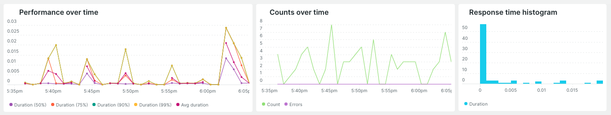
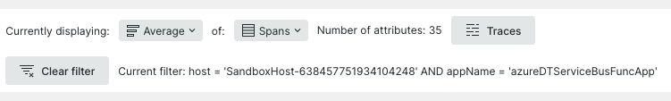
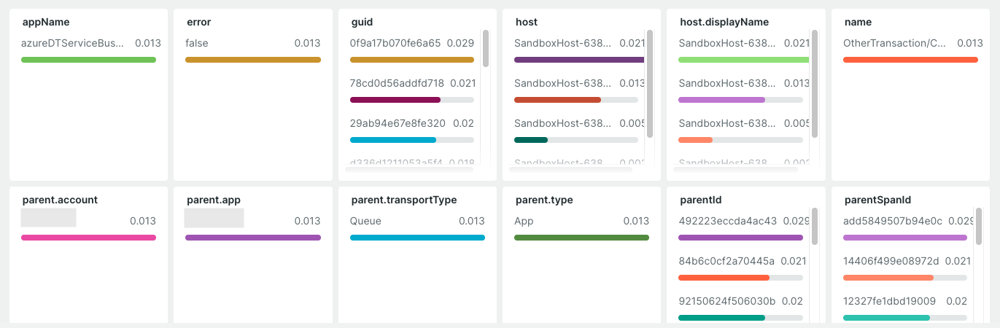
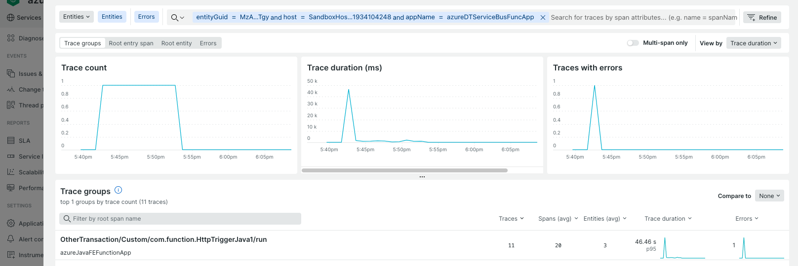

<a href="https://opensource.newrelic.com/oss-category/#new-relic-experimental"><picture><source media="(prefers-color-scheme: dark)" srcset="https://github.com/newrelic/opensource-website/raw/main/src/images/categories/dark/Experimental.png"><source media="(prefers-color-scheme: light)" srcset="https://github.com/newrelic/opensource-website/raw/main/src/images/categories/Experimental.png"></picture></a>


# Attribute Explorer
This application gives you an alternative way of exploring the performance of your services via attributes. For example, if a pricing engine has a custom attribute for product id, you can understand the response times by product id, as well as other standard attributes like errors, hosts, url's, etc. The application displays the response times and execution counts by different attributes. You can then filter by different attributes and drill into a subset of traces matching the filters selected.

The application works for both OTEL and New Relic APM services. Spans are displayed for OTEL services, where as you can select from transactions, errors and spans for New Relic APM services. When selecting spans response times are given across all spans, not just entry spans.

The UI contains 3 sections, the upper section contains the performance charts:



Performance data, counts (total and errors) and a histogram of response times. These charts change depending on what attributes have been selected.

The middle section performs a number of functions:


- It allows the user to select the performance metric displayed for each of the attributes in the lower section (50th, 75th, 90th and 99th percentile, as well as average and count).
- For New Relic APM you can select from the Transaction, TransactionError and Span event type.
- It shows a count of the number of attribute charts being displayed in the lower section.
- Gives a Traces button, which allows the user to launch from here into a filtered view of traces (filtered by the attributes selected).
- A button so the user can clear all current attribute filters.
- The current attribute values for which the UI is filtered on (upper performance charts and lower attribute charts).

The lower section displays performance data for the attributes:



For example, if the 90th percentile is selected then the host attribute chart would display the 90th percentile response time broken down by the top 10 hosts. Clicking on any of the attribute values will filtered the UI by that value. For example, clicking on true in the error attribute chart would then display performance charts for all attributes where error is true. Clicking on the attribute value again will clear the filter.

Clicking on the Traces button in the middle section will give an overlay filtered traces view:



To launch the application go to an APM or OTEL service and select Attribute Explorer in the lower half of the left hand menu.
## Installation

Clone this repository and run the following scripts to serve locally:

```
cd nr1-attribute-explorer
nr1 nerdpack:uuid -gf
npm install
nr1 nerdpack:serve
```

Then visit https://one.newrelic.com/?nerdpacks=local or https://one.eu.newrelic.com/?nerdpacks=local

To publish to your account run:
```
nr1 nerdpack:publish
```


# Support

New Relic has open-sourced this project. This project is provided AS-IS WITHOUT WARRANTY OR DEDICATED SUPPORT. Issues and contributions should be reported to the project here on GitHub.

>We encourage you to bring your experiences and questions to the [Explorers Hub](https://discuss.newrelic.com) where our community members collaborate on solutions and new ideas.

# Contributing

We encourage your contributions to improve [Project Name]! Keep in mind when you submit your pull request, you'll need to sign the CLA via the click-through using CLA-Assistant. You only have to sign the CLA one time per project. If you have any questions, or to execute our corporate CLA, required if your contribution is on behalf of a company, please drop us an email at opensource@newrelic.com.

**A note about vulnerabilities**

As noted in our [security policy](../../security/policy), New Relic is committed to the privacy and security of our customers and their data. We believe that providing coordinated disclosure by security researchers and engaging with the security community are important means to achieve our security goals.

If you believe you have found a security vulnerability in this project or any of New Relic's products or websites, we welcome and greatly appreciate you reporting it to New Relic through [HackerOne](https://hackerone.com/newrelic).

# License
Historical Multi-series Comparison is licensed under the [Apache 2.0](http://apache.org/licenses/LICENSE-2.0.txt) License.
Historical Multi-series Comparison also uses source code from third-party libraries. You can find full details on which libraries are used and the terms under which they are licensed in the third-party notices document.